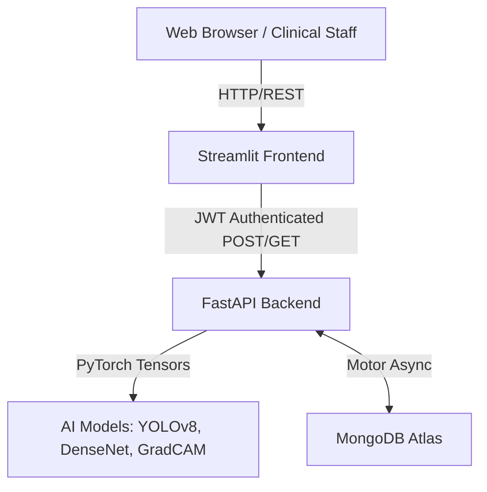

# Lung Cancer Detection System - Architecture

## High-Level System Architecture

The Lung Cancer Detection AI System is built upon a modern, modular microservices architecture designed for high availability, scalability, and clinical reliability.

### 1. Frontend: Streamlit Clinical Dashboard (`app/`)
The frontend is a lightweight, responsive dashboard built using Streamlit.
- **Decoupled Operation:** Acts entirely as a presentation layer. It does not load or run machine learning inference locally.
- **REST Integrations:** Uses HTTP `requests` to securely communicate with the FastAPI backend for authentication, predictions, and history log retrieval.

### 2. Backend: FastAPI Microservice (`backend/`)
A high-performance asynchronous REST API powered by FastAPI.
- **Role-Based Access Control (RBAC):** Secures endpoints using JWT authentication. Roles include `Admin`, `Doctor`, and `User`.
- **Database Connection:** Asynchronously interfaces with MongoDB Atlas using the `motor` driver to persist patient history and model inferences.
- **ML Integration:** Directly invokes the inference engines and formats the responses, acting as a gateway between the AI logic and the client.

### 3. Machine Learning Pipeline (`src/`)
The core research-grade AI logic is split into discrete functional modules:
- **`src/preprocessing`**: Handles DICOM/PNG ingestion, normalization, and artifact removal.
- **`src/models/unet3d.py`**: A 3D U-Net architecture built for volumetric lung nodule segmentation.
- **`src/detection`**: Wraps the YOLOv8 object detection model to identify the bounding boxes of suspected nodules.
- **`src/models/classifier.py`**: Houses the custom DenseNet121 and EfficientNet-B4 architectures configured for Transfer Learning to classify nodules as Malignant or Benign.
- **`src/xai`**: The Explainable AI module. Uses PyTorch hooks to implement **Grad-CAM**, generating heatmap overlays highlighting the regions that triggered the model's classification.
- **`src/risk`**: A rule-based Risk Scoring and Recommendation engine that combines model confidence with clinical priors (Age, Smoker status) to stratify patient risk.

---

## Deployment Architecture

The system is containerized via Docker and orchestrated using Docker Compose for local environments. For production, it leverages Render's Platform-as-a-Service (PaaS).

